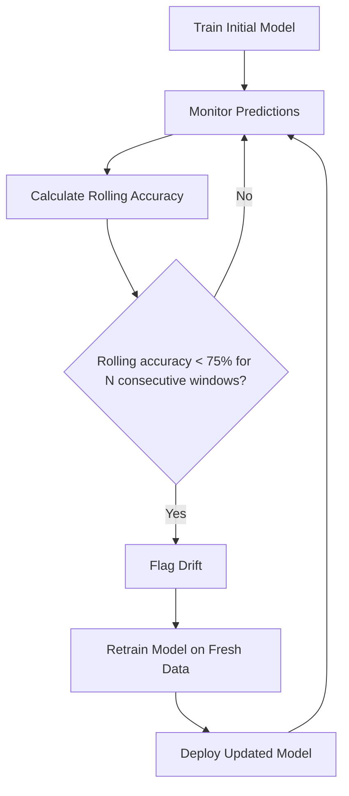

<div align="center">

# 🩺 AutoHeal

### A self-healing ML pipeline that detects concept drift via rolling-accuracy monitoring and automatically retrains — no manual intervention required once running.

[](https://python.org)
[](https://scikit-learn.org)
[](https://pandas.pydata.org)
[](https://matplotlib.org)
[](LICENSE)

</div>

---

## ⚡ What This Does

Traditional ML systems silently degrade in production as data drifts away from what they were trained on — someone has to notice the drop and manually retrain. **AutoHeal automates that recovery loop.** It continuously monitors rolling prediction accuracy, detects when performance falls below a threshold for several consecutive windows, retrains the model on fresh data, and redeploys it.

This is currently demonstrated on two benchmark datasets — **Breast Cancer Wisconsin Diagnostic** and **Iris** — with *synthetically injected* concept drift (not real production drift), benchmarked against two baselines: no monitoring, and fixed-schedule retraining.

📄 Full methodology diagram: [`AutoHeal_Methodology_Diagram.pdf`](AutoHeal_Methodology_Diagram.pdf)

---

## 🎯 Results

### Single-run comparison (Breast Cancer dataset, 100-cycle stream, exact numbers from `results/comparison_results.csv`)

| Method | Accuracy During Drift | Retrains | Manual Intervention |
|---|---|---|---|
| No monitoring | 27.0% (stays degraded) | 0 | Yes |
| Scheduled retraining | 36.0% (fixed midpoint retrain) | 1 (fixed schedule) | Yes |
| **AutoHeal (proposed)** | **40.0%** | **27** | **No** |

*(See Fig 2 below.)* AutoHeal beats no-monitoring by **+13.0 percentage points** and scheduled retraining by **+4.0 points** — but it earns that by retraining **27 times** over 100 monitoring cycles, versus 1 fixed retrain for the scheduled baseline. That's a real cost, not a rounding artifact: the drift-detection gate here (20-prediction window, 75% threshold, 3-strikes-and-retrain) is tuned tightly enough that it re-fires often under sustained noisy input. The accuracy gain is genuine but the retraining frequency is the fair trade-off to disclose alongside it — see Limitations.

### Full recovery trajectory (single run, Run 1 of the Breast Cancer 5-run set)

Baseline accuracy is **93.86%** for this specific run (see `breast_cancer_results.csv`, row 1). Once drift is injected, rolling accuracy falls; the drift-trigger fires at monitoring-cycle index **48** (per `drift_trigger_idx` in the CSV). Accuracy keeps falling during the retrain/redeploy lag, bottoming out at **36.0%**, before the new model is deployed and accuracy climbs back up to a recovery-phase mean of **80.1%** for this run.


### Across 5 independent runs (Breast Cancer) — exact values from `results/breast_cancer_results.csv`

| Run | Baseline | Min During Drift | Retrain-Time Acc | After Recovery | Redeployed |
|---|---|---|---|---|---|
| 1 | 93.86% | 36.00% | 96.49% | 80.13% | Yes |
| 2 | 95.61% | 40.00% | 95.61% | 81.85% | Yes |
| 3 | 98.25% | 36.00% | 97.37% | 81.80% | Yes |
| 4 | 97.37% | 30.00% | 95.61% | 82.40% | Yes |
| 5 | 98.25% | 26.00% | 96.49% | 81.95% | Yes |
| **Mean ± std** | **96.67% ± 1.90%** | **33.60% ± 5.55%** | **96.32% ± 0.74%** | **81.63% ± 0.87%** | **5/5** |

Min-during-drift varies noticeably across runs (26–40%), but post-recovery accuracy is tightly clustered (80.1–82.4%) in every run — the strongest evidence in this repo that the recovery mechanism is reliable even though drift severity itself is stochastic. Note also that the retrained model's own held-out accuracy (96.32% mean) sometimes comes in *below* the original baseline for that run (e.g. Run 3: 97.37% retrain vs 98.25% baseline) — the pipeline accepts a retrained model as long as it's within a 2-percentage-point tolerance of baseline, it doesn't require the new model to be strictly better.


### Breast Cancer vs Iris (mean ± std across 5 runs, exact values from `results/breast_cancer_results.csv` and `results/iris_results.csv`)

| Stage | Breast Cancer | Iris |
|---|---|---|
| Baseline | 96.67% ± 1.90% | 96.67% ± 4.08% |
| Min during drift | 33.60% ± 5.55% | 27.33% ± 2.79% |
| After recovery | 81.63% ± 0.87% | 85.40% ± 1.30% |
| Redeployments | 5/5 runs | **2/5 runs** |

Recovery accuracy on both datasets lands well above the 75% threshold, but notably **below original baseline** (~97%) — the retrained model recovers *functionality*, not full original performance.

**Worth flagging:** for Iris, only **2 of 5 runs** actually redeployed a new model (`redeployed=True` in the CSV). In the other 3 runs, the retrained candidate didn't clear the acceptance bar (within 2 points of baseline), so the *original* pre-drift model was kept in production instead. Recovery accuracy in those cases (e.g. Run 1: 85.39% with `redeployed=False`) isn't from a "healed" model — it's the old model doing fine once the drifted inputs stop arriving. This is a meaningfully different success mode than the Breast Cancer runs (5/5 redeployed) and isn't visible from the chart alone — only from the raw CSV.


---

## 🧠 How It Works



**Drift detection details** (exact parameters, pulled directly from `autoheal.py`):
- Metric: rolling-window classification accuracy, recomputed each monitoring cycle
- Rolling window: 50 predictions (Breast Cancer per-run cycle), 30 predictions (Iris per-run cycle), 20 predictions (the 3-method comparison experiment)
- Threshold: rolling accuracy < 75%
- Trigger condition: threshold breach sustained over 3 consecutive windows before a retrain fires (`consec_k=3`), to avoid retraining on a single noisy dip
- Drift injection: synthetic — Gaussian noise (mean 5.0, std 3.0 for Breast Cancer; mean 3.0, std 2.0 for Iris) added to feature vectors partway through the stream, simulating covariate shift
- Retrain source: fresh labeled data assumed available at trigger time (an 80/20 re-split of the same dataset) — see Limitations, this is a simplification vs. real deployments where labels lag
- Acceptance rule: the retrained model is deployed only if its held-out accuracy is within 2 percentage points of the original baseline; otherwise the old model is kept (see the Iris redeployment numbers above for how often this matters in practice)

---

## 🏗️ Architecture

- **Model:** Random Forest Classifier (scikit-learn)
- **Drift detection:** Rolling-window accuracy monitoring, 75% threshold, consecutive-failure gating
- **Datasets:** Breast Cancer Wisconsin Diagnostic, Iris (synthetic injected drift)
- **Retraining trigger:** Automatic, threshold-based
- **Outputs:** CSV result summaries + PNG visualizations, generated per run

---

## ⚠️ Limitations

Being upfront about scope, since the results above should be read in that context:

- **AutoHeal retrains far more often than "as needed" implies.** In the 100-cycle comparison experiment, AutoHeal retrained **27 times** to get its 40.0% accuracy figure, versus 1 fixed retrain for the scheduled baseline. The accuracy win (+4 points over scheduled retraining) comes at roughly 27x the retraining cost in this experiment. This is the single most important number missing from earlier versions of this README, and it changes the framing from "efficient self-healing" to "aggressive, compute-hungry self-healing that happens to also be more accurate." Whether that trade-off is worth it depends entirely on retrain cost in a real deployment, which this repo doesn't measure.
- **Drift is synthetic**, injected at a known point in a known way (Gaussian noise on features). Real production drift is gradual, partial, and often undetectable by accuracy alone (e.g., label delay, covariate shift without immediate accuracy impact).
- **Fresh labeled data is assumed available** at retrain time (an 80/20 re-split of the same static dataset). In production, labels often lag predictions by hours/days/weeks — this pipeline doesn't model that lag.
- **Recovery accuracy (~80–85%) is below original baseline (~97%)** — the system restores the model to "good enough," not "as good as before." This is a meaningful gap, not just rounding.
- **Redeployment isn't guaranteed even when retraining fires.** In the Iris experiments, only 2 of 5 runs actually swapped in a new model; the other 3 kept the original model because the retrained candidate didn't clear the 2-point acceptance tolerance. "AutoHeal ran" and "AutoHeal deployed a new model" are different events, and the README/figures don't currently distinguish them visually.
- **No retraining cost (compute/time) is reported anywhere**, despite retrain frequency varying by 27x between methods in the comparison experiment above. This is the most impactful gap to close next.
- **Two datasets, both small tabular benchmarks.** No evidence yet this generalizes to larger, streaming, or non-tabular data.
- **No significance testing.** The 5-run mean ± std in Fig 4 gives variance, but there's no test (e.g., paired t-test) confirming AutoHeal's edge over scheduled retraining is statistically distinguishable from noise across runs.

---

## ⚙️ Setup

### Prerequisites
- Python 3.10+
- pip

### Run it

```bash
# Clone the repo
git clone https://github.com/ShreyaSindhe/AUTO-HEAL.git
cd AUTO-HEAL

# Install dependencies
pip install -r requirements.txt

# Run the pipeline
python autoheal.py
```

Each run regenerates a `results/` folder containing:
- `breast_cancer_results.csv`, `iris_results.csv`, `comparison_results.csv`
- `fig1_accuracy_over_time.png` through `fig5_combined_paper.png`

**Typical runtime:** ~30 seconds on a standard laptop CPU (no GPU needed — dominated by roughly a dozen RandomForest fits across all experiments). The script now prints total elapsed time at the end of its run.

Sample tail of console output:
```
FINAL RESULTS SUMMARY
...
  Comparison Method                     Accuracy   Retrains    Human
  -----------------------------------------------------------------
  No monitoring (baseline)            27.00%      0          Yes
  Scheduled retraining                36.00%      1          Yes
  AutoHeal (proposed)                 40.00%      27           No

  AutoHeal improvement vs no-monitor:     +13.0 pp
  AutoHeal improvement vs scheduled:      +4.0 pp
  AutoHeal retrain count (100-cycle stream): 27  <- this is a real cost, not a rounding artifact.

  Total runtime: 31.4s
```

---

## 🔬 Experiments

The pipeline runs:

- Initial model training on clean data
- Concept drift simulation (synthetic injection)
- Rolling-accuracy drift detection (75% threshold, consecutive-window gating)
- Automatic retraining on drift detection
- Recovery evaluation post-retrain
- Baseline comparison (no monitoring vs. scheduled retraining vs. AutoHeal)
- Repetition across 5 independent runs for variance estimation
- Automatic visualization of all results

---

## 📁 Project Structure

```
AUTO-HEAL/
├── autoheal.py                       # Main pipeline script
├── requirements.txt                  # Python dependencies
├── .gitignore
├── README.md
├── AutoHeal_Methodology_Diagram.pdf  # Methodology diagram
├── docs/
│   └── images/                       # Result plots shown in this README
└── results/                          # Generated per run (CSVs + PNGs) — not tracked in git
```

---

## 🚀 Future Work

- [ ] Track and report per-retrain compute/wall-clock cost, given the 27x retrain-frequency gap found between AutoHeal and scheduled retraining
- [ ] Add a retrain-frequency cap or cooldown period as a tunable knob, so accuracy-vs-cost can be traded off deliberately instead of implicitly
- [ ] Visually distinguish "retrain fired" from "new model deployed" in Fig 1/5 (currently only visible in the raw CSV via `redeployed`)
- [ ] Additional drift detection algorithms (ADWIN, Page-Hinkley) for comparison against the current rolling-accuracy method
- [ ] Model label-lag realistically instead of assuming instant fresh labels at retrain time
- [ ] Statistical significance testing between methods (not just mean ± std)
- [ ] MLOps integration — experiment tracking, model registry, CI/CD
- [ ] Real-time streaming data support
- [ ] Deep learning model support
- [ ] Cloud deployment
- [ ] Interactive monitoring dashboard

---

## 🛠️ Tech Stack

`Python` `scikit-learn` `Pandas` `NumPy` `Matplotlib`

---

## 👥 Contributors

| Name | GitHub | Focus |
|---|---|---|
| Shreya Sindhe | [@ShreyaSindhe](https://github.com/ShreyaSindhe) | Rolling-window drift detection algorithm, automatic retraining trigger logic, experiment validation on Breast Cancer and Iris |
| Tharun C | [@Tharunnxx](https://github.com/Tharunnxx) | Baseline comparison framework (no-monitoring vs. scheduled vs. AutoHeal), statistical analysis across runs, visualization suite |

---

## 📄 License

This project is licensed under the MIT License — see the [LICENSE](LICENSE) file for details.

---

<div align="center">

Feedback, issues, and contributions are welcome. If you find AutoHeal useful, a star is appreciated.

</div>
