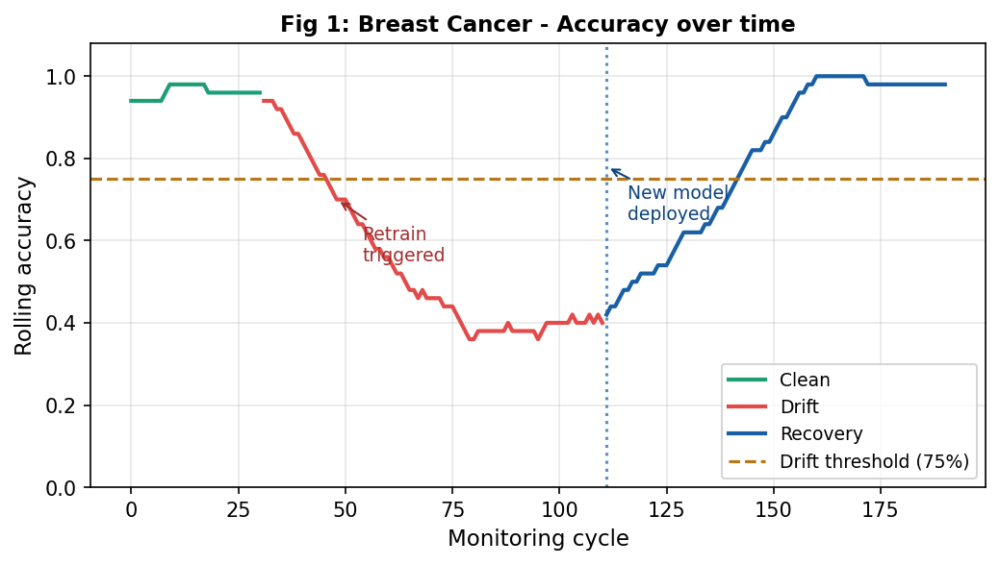
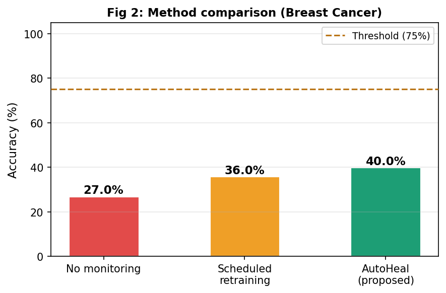
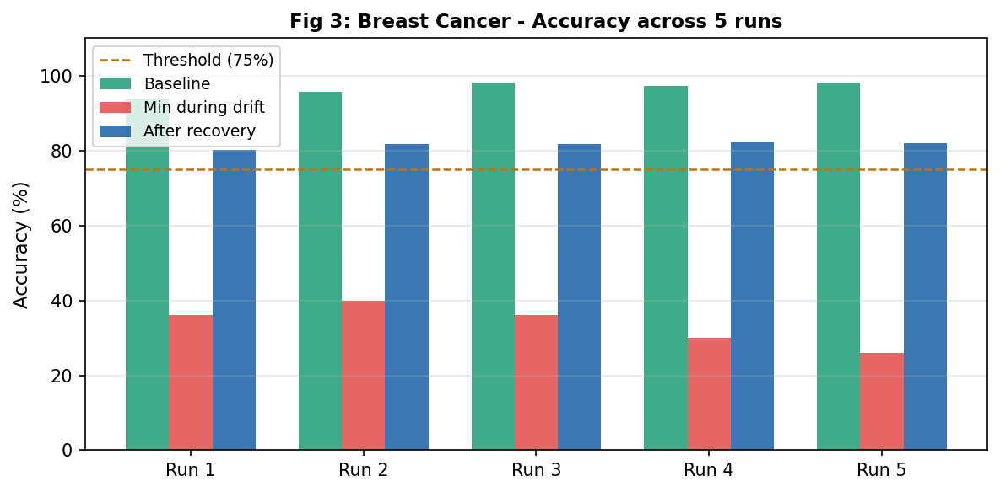
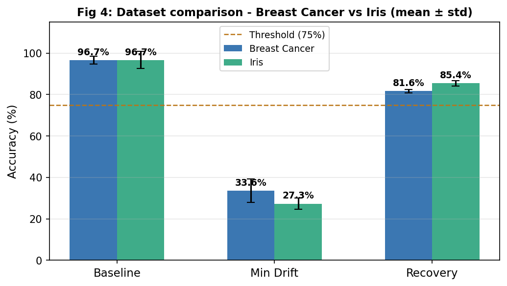
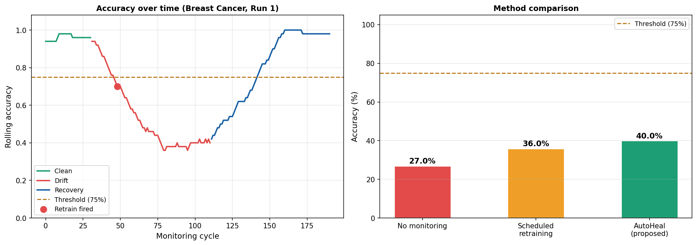

# AutoHeal

> An autonomous self-healing machine learning pipeline that continuously monitors model performance, detects concept drift, and automatically retrains models to maintain prediction accuracy.

## Overview

AutoHeal is a machine learning framework designed to automatically detect performance degradation caused by concept drift and recover model performance through autonomous retraining.

Unlike traditional machine learning systems that require manual intervention, AutoHeal continuously monitors prediction accuracy, detects drift using rolling performance metrics, and redeploys an updated model whenever necessary.

The project evaluates its effectiveness using the Breast Cancer Wisconsin Diagnostic and Iris datasets, and compares its performance against conventional monitoring strategies (no monitoring, and fixed-schedule retraining).

## Features

- Automatic concept drift detection
- Autonomous model retraining
- Continuous performance monitoring
- Rolling accuracy analysis
- Random Forest classification
- Performance comparison with baseline approaches
- Classification reports
- Confusion matrix generation
- Experimental result visualization
- Results automatically saved as CSV and PNG files

## Workflow

```text
Train Initial Model
        |
        v
Monitor Predictions
        |
        v
Calculate Rolling Accuracy
        |
        v
   Performance Drop?
    |            |
   No           Yes
    |            |
Continue    Detect Drift
                 |
                 v
          Retrain Model
                 |
                 v
       Deploy Updated Model
                 |
                 v
       Continue Monitoring
```

## Tech Stack

- Python 3
- Scikit-learn
- NumPy
- Pandas
- Matplotlib

## Project Structure
AUTO-HEAL/
|-- autoheal.py                       Main pipeline script
|-- requirements.txt                  Python dependencies
|-- .gitignore                        Files/folders excluded from version control
|-- README.md                         Project documentation
|-- AutoHeal_Methodology_Diagram.pdf  Methodology diagram
|-- docs/
|   +-- images/                       Sample result plots shown in this README
+-- results/                          Generated on each run (CSVs + PNGs), not tracked in git
## Installation

Clone the repository:

```bash
git clone https://github.com/ShreyaSindhe/AUTO-HEAL.git
```

Move into the project:

```bash
cd AUTO-HEAL
```

Install dependencies:

```bash
pip install -r requirements.txt
```

Run the project:

```bash
python autoheal.py
```

Each run regenerates the `results/` folder with the CSV summaries and PNG figures shown below.

## Experiments

The project performs:

- Initial model training
- Concept drift simulation
- Drift detection
- Automatic retraining
- Recovery evaluation
- Baseline comparison (no monitoring vs. scheduled retraining vs. AutoHeal)
- Statistical analysis across multiple runs
- Visualization of results

## Results

AutoHeal demonstrates the ability to:

- Detect concept drift automatically
- Restore model accuracy after degradation
- Reduce manual intervention
- Outperform traditional monitoring strategies in maintaining prediction performance

### Accuracy Over Time

Rolling accuracy on the Breast Cancer dataset through clean, drift, and recovery phases. AutoHeal detects the drift, triggers a retrain, and restores accuracy above the threshold.



### Method Comparison

AutoHeal compared against no-monitoring and fixed-schedule retraining baselines.



### Breast Cancer - Five Run Recovery

Accuracy recovery across five independent runs on the Breast Cancer dataset.



### Dataset Comparison

Baseline, drift, and recovery accuracy compared across the Breast Cancer and Iris datasets.



### Combined Summary

A combined view of all key results for reporting purposes.



## Future Work

- Deep learning support
- Real-time streaming data
- Additional drift detection algorithms (e.g. ADWIN, Page-Hinkley)
- MLOps integration (experiment tracking, model registry, CI/CD)
- Cloud deployment
- Interactive monitoring dashboard

## Author

*Shreya Sindhe*
